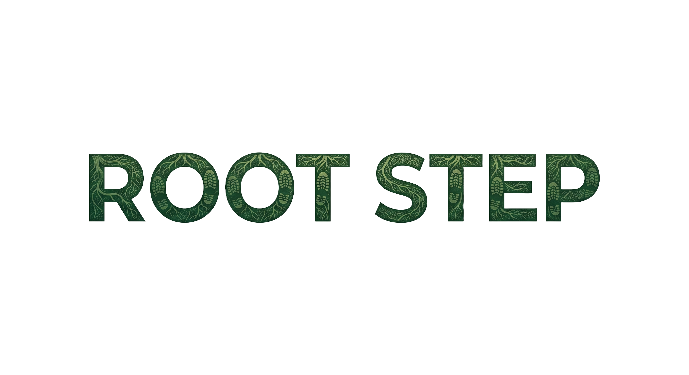
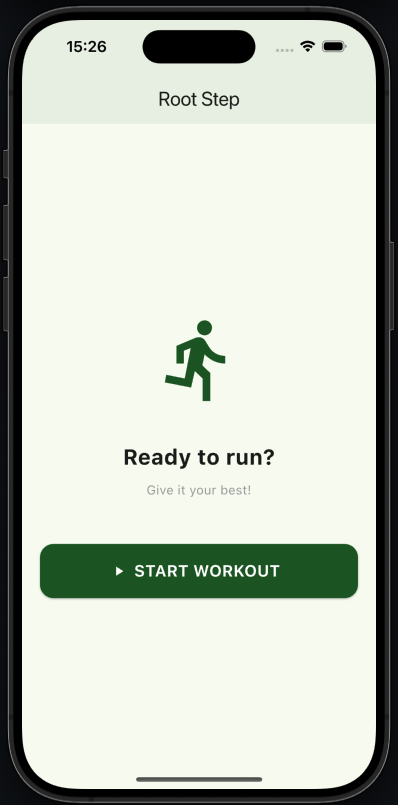
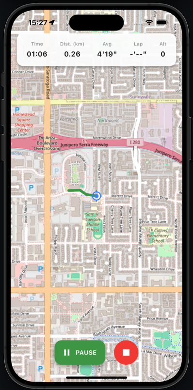

# 🏃‍♂️ RootStep: The Community-Driven Running App

**RootStep** is a fully Open Source fitness tracking app, born for runners who want full control over their data. No subscriptions, no invasive tracking—just you and the road.

---

## ✨ Why RootStep?
The goal is to create a transparent alternative to commercial apps, offering a modern tech stack and an inclusive community.

- 📍 **Live Tracking:** Precise GPS-based monitoring.
- 🗺️ **Offline Maps:** Powered by `flutter_map` and advanced caching, your maps are always available.
- 🛡️ **Privacy by Design:** No data is sent to external servers without your explicit consent.
- 🔋 **Battery Efficient:** Optimized to last through your longest marathons.

---

## 📱 Screenshots
| Home Screen | Live Tracking |
| :---: | :---: |
|  |  |

---

## 🛠 Tech Stack
* **Frontend:** Flutter (Dart)
* **Maps:** OpenStreetMap via [flutter_map](https://pub.dev/packages/flutter_map)
* **Local Storage:** Hive & Path Provider
* **Geolocation:** Geolocator API

---

## 🚀 Quick Start for Developers

You need Flutter installed on your system. If you don't have it, follow the [official guide](https://docs.flutter.dev/get-started/install).

1. **Clone the repository** `git clone https://github.com/Galimba03/rootstep`  
   `cd rootstep`

2. **Install packages** `flutter pub get`

3. **Run the app** `flutter run`

---

## 🤝 Contribute to the Project
We are in the early stages and every contribution is valuable! If you want to participate:

1. **Fork** the project.
2. Create a **Branch** for your feature (`git checkout -b feature/AmazingFeature`).
3. **Commit** your changes (`git commit -m 'Add some AmazingFeature'`).
4. **Push** to the branch (`git push origin feature/AmazingFeature`).
5. Open a **Pull Request**.

### 📋 What we are looking for:
- [ ] **Graphics** A designer or an artist willing to create some graphics.
- [ ] **Data Visualization:** Charts for average pace and elevation.
- [ ] **Background Tasks:** Advanced GPS management when the screen is off.
- [ ] **Polyline Logic:** Implementation of path drawing on the map.
- [ ] **Dark Mode:** Support for dark theme.

---

## 🗺 Roadmap
- [x] Base project and navigation.
- [x] Real-time Map and GPS integration.
- [x] Map Caching system.
- [x] Path tracking with Polyline.
- [x] Stat calculations (Distance, Pace, Calories).
- [ ] **next** GPX file export.
- [ ] Better UX/UI.
- [ ] More features coming soon...

---

## ⭐ Support Us
If you believe in open-source fitness, leave a **Star** on this repository to help us grow!

---

**License:** Distributed under the MIT License. See `LICENSE` for details.